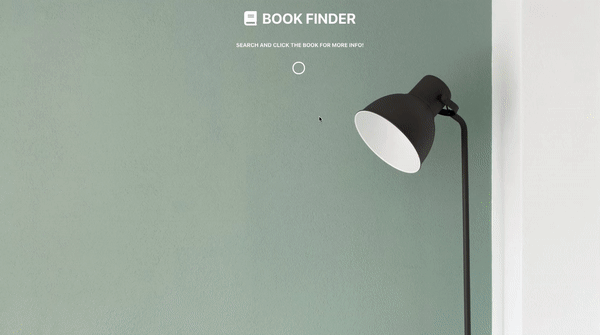

# Google Books API Project

This single page website lets you search for a book title using Google Books API.
You can click on the book and it will open to a new tab, showing the book information
on Google's website.

# Available Scripts
This project was bootstrapped with Create React App.

In the project directory, you can run:

`npm start`
`npm test`
`npm run build`
`npm run eject`

 # Demo
 
 
 Built in localhost. Uploaded in personal website.
